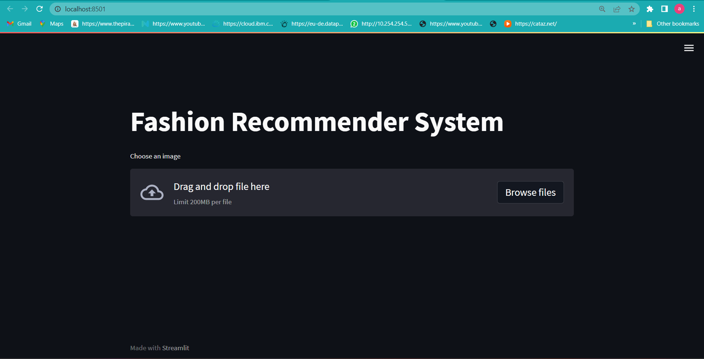
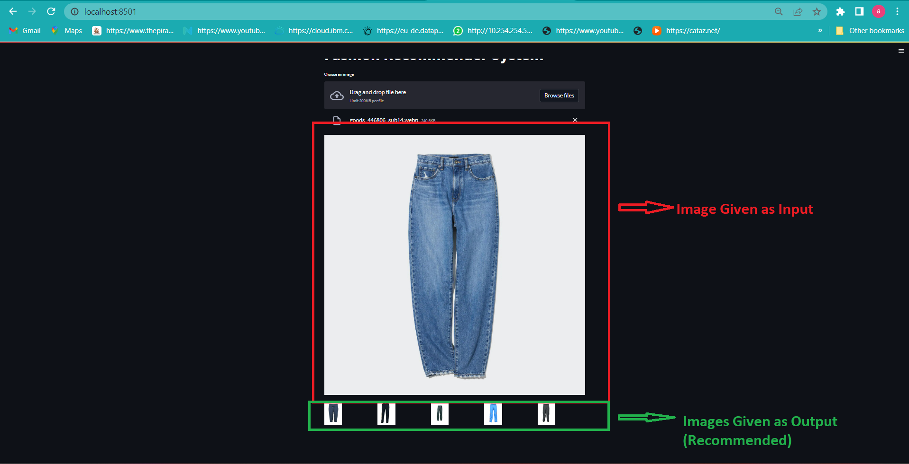

# Fashion Recommendation System

-----------------------------
### Software and Tools Requirements
1. [GitHub Account](https://www.github.com) 
2. [Pycharm IDE](https://www.jetbrains.com/pycharm) 
3. [GitCLI](https://git-scm.com/downloads)
4. [python]()
5. [Anaconda]()
6. [jupyter]()
7. [scikit-learn]()
8. [Tensorflow]()
9. [Streamlit]()
10. [Pandas]()

---------------------------
This is an End to End Project where a web app is created to show how the model works and
interacts with the front end structure.

The Dataset was Taken from kaggle.The original Dataset was too large(25GB),so i used a small image dataset

The screenshot of the web app are given below:

The above webpage accepts a image from any directory and then based
on that image recommends similar fashion accessories.

The output will be somthing like this:

The Model was trained using ResNet50 with imagenet dataset
and KNN algorithm was used to find the closest images.

